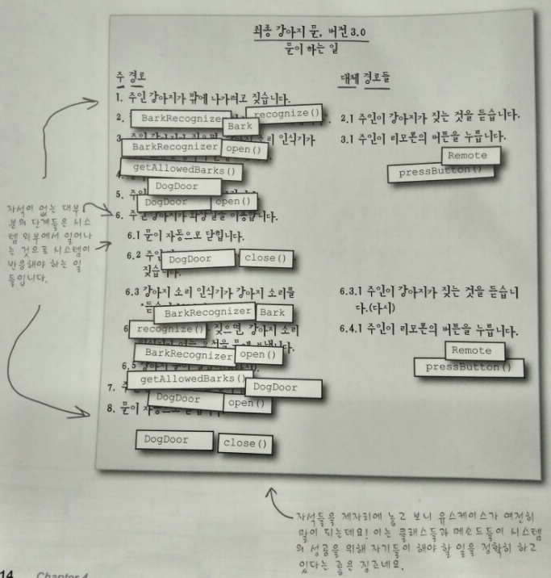
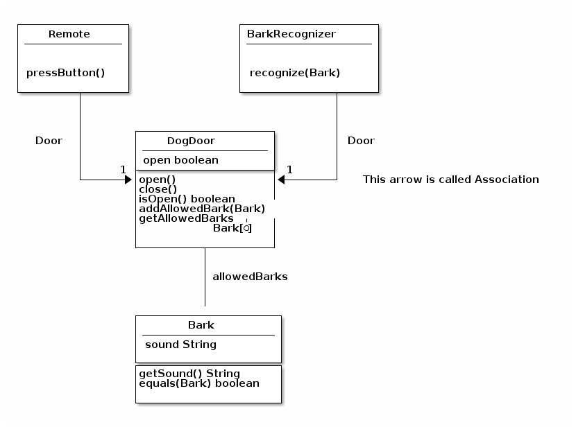

<!-- TOC depthFrom:1 depthTo:6 withLinks:1 updateOnSave:1 orderedList:0 -->

- [chapter4 정리](#chapter4-)
	- [분석](#)
		- [1. 본문 분석](#1-)
			- [클래스들과 메소들을 찾아내기 위해 유스케이스에서 명사(와 동사)를 분석하는 것을 **본문 분석**이라고 합니다.](#-)
		- [2. 명사는 객체입니다.](#2-)
			- [여기에는 `Bark` 클래스가 없습니다.](#-bark-)
		- [3. 유스케이스에서 단어들은 중요합니다.](#3-)
		- [4. 바보같은 질문이란 없습니다.(p.209)](#4-p209)
			- [잘 만든 유스케이스는 시스템이 하는 일을 **명확히** 그리고 **정확히** 이해하기 쉬운 언어로 설명합니다. 유스케이스를 잘 만든 후에, 유스케이스의 **본문 분석**을 통해 시스템에서 필요한 클래스들을 빠르고 쉽게 찾을 수 있습니다.](#-)
		- [5. 분석의 힘](#5-)
			- [왜 `Dog` 클래스가 없을까요?](#-dog-)
			- [유스케이스 안의 **명사들**이 클래스가 되지 않더라도 집중하세요.](#-)
			- [클래스들이 어떻게 유스케이스가 설명하는 시스템의 동작을 도와줄 수 있는 지 생각해보세요.](#-)
		- [6. 동사는 오퍼레이션입니다.](#6-)
			- [코드 자석](#-)
			- [연필을 깍으며 해답 : 왜 `Dog` 클래스가 없을까요?](#-dog-)
		- [7. 바보같은 질문이란 없습니다.(p215)](#7-p215)
		- [8. 분석을 잘해서 적당한 클래스 찾기, 연관과 다중도](#8-)
			- [마리아의 강아지문 클래스 다이어그램](#-)
			- [연필을 깍으며 : `DogDoor` 클래스의 `allowedBarks` 속성으로 어떤 타입들을 사용할 수 있을까요?](#-dogdoor-allowedbarks-)
		- [9. 왜 클래스 다이어그램을 사용하죠?](#9-)
			- [클래스 다이어그램이 전부는 아닙니다.](#-)
		- [10. 다이어그램에서 뭐가 빠진거죠?](#10-)
			- [`recognize()`는 어떻게 동작하나요?](#recognize-)
		- [11. 핵심정리](#11-)
		- [12. 코딩 조각들 채우기 디자인 퍼즐](#12-)
		- [13. 나의 정의는 무엇일까요?](#13-)

<!-- /TOC -->

# chapter4 정리

## 분석

### 1. 본문 분석

* 마리아 : 명사를 찾는 중에 `Bark` 클래스가 필요하다는 것을 알게 되었다.

> 유스케이스의 명사들이 클래스로 사용된다.
하지만 "주인", "요청", "안" 같은 명사들은 클래스로 쓰이지 않는다.
당신이 나타내야 할 시스템의 일부를 위해서만 클래스가 필요하다는 것을 기억하세요.
우리의 소프트웨어가 나타낼 필요가 없는 "밖","안","주인"에 대한 클래스는 필요 없어요.

* "버튼"은 리모콘의 부분이니깐 클래스가 필요 없다.(이미 리모콘 클래스가 있다.)
* 샘 : 나도 `Bark` 클래스를 유스케이스를 분석하지 않고 사용했다.
* 마리아 : 하지만 제대로 된 강아지문을 만들지 못했어요.
* 샘 : 맞아요. 하지만 당신은 `Bark` 객체를 하나 이상 저장한 거 잖아요. 이게 유스케이스와 무슨 관계죠?

#### 클래스들과 메소들을 찾아내기 위해 유스케이스에서 명사(와 동사)를 분석하는 것을 **본문 분석**이라고 합니다.

### 2. 명사는 객체입니다.

_기존 유스케이스 3단계 살펴보기_

3. **주인강아지**가 짖으면, **강아지 소리 인식기**가 문을 열라는 **요청**을 강아지 **문**에 보낸다.

* 주인 강아지 : 명사지만, 강아지는 액태이고, 시스템의 외부에 있는 것이기 때문에 클래스가 필요하지 않다.
* 강아지 소리 인식기 : `BarkRecognizer`
* 요청 : 이 요청은 강아지 소리 인식기가 강아지 문(`DogDoor`)에 `open()` 메소드를 호출하는 것으로 표현된다.
* 문 : `DogDoor`


#### 여기에는 `Bark` 클래스가 없습니다.

_랜디 작성 유스케이스 3단계 살펴보기_

3. **주인 강아지의 소리**가 강아지 소리 인식기가 들은 소리와 일치하면, 강아지 문이 열려야 합니다.

* 강아지가 아닌 **소리**에 중점을 두었다.

### 3. 유스케이스에서 단어들은 중요합니다.

* 기존 유스케이스와 랜디 유스케이스는 비슷한데 다릅니다.
* 기존 유스케이스의 초점 : **강아지**
  - 강아지가 짖을 때 어떤 소리를 내는지는 중요하지 않습니다. 시스템은 강아지가 짖기만 하면 문을 엽니다.
* 랜디 유스케이스의 초점 : **소리**
  - 강아지가 1개 이상의 소리를 낼 경우는 어쩌죠? 두 강아지의 소리가 비슷할 경우는?
* 위 2개는 비슷해 보이지만 다릅니다.

### 4. 바보같은 질문이란 없습니다.(p.209)

Q : 유스케이스만 작성하면, 프로그램은 잘 동작할 것이라는 말인가요?
A : 글쎄요. 유스케이스를 작성하는 것이 좋은 소프트웨어를 만드는 시작입니다. 하지만 이것 말고도 해야 할일이 많습니다. **분석은 유스케이스를 통해 클래스들을 찾기 쉽게 합니다.**

Q : 나는 전에 유스케이스를 사용한 적이 없고 문제가 없었습니다. 좋은 프로그램을 만들려면 유스케이스를 작성해야만 한다고 말하는 건가요?
A : 아닙니다. 유스케이스 몰라도 좋은 프로그램을 만들 수 있어요. **하지만 고객을 만족시키고, 코드를 효율적으로 작성하려면, 유스케이스가 요구 사항을 정하는 데 도움을 줄 수 있습니다.**

Q : 명사들과 분석에 관한 것들은 좀 까다로운 것 같아요. 나는 문법에 약해요. 어쩌죠?
A : 문법에 초점을 맞출 필요가 없습니다. 일상 언어로 유스케이스를 작성하세요. '~것'이 있는지 찾아내세요. 대부분 명사들입니다. **각 명사에 대해 클래스로 나타낼 필요가 있는지 생각하면, 시스템에 대한 분석은 잘 시작한 것이빈다.**

Q : 하지만 랜디처럼 사용하지 말아야 할 명사(소리)를 사용하는 등의 실수를 하면 어쩌죠?
A : 랜디의 실수 - 강아지 **소리**를 명사로 사용한 점, 문법과 상관 없으며 시스템이 실제 상황에서 어떻게 작동할 지를 생각하지 않았습니다.
**주인의 강아지를 밖에 내보내는데에 집중하지 않고, 특정 강아지 소리만 고려 한거죠.**
**유스케이슬 작성할 때, 여러번 읽고 확인하고 친구, 동료들에게 읽어보게 해서 완벽한 환경이 아니라 실제 상황에서 잘 동작할 지 확인 해야 합니다.**

#### 잘 만든 유스케이스는 시스템이 하는 일을 **명확히** 그리고 **정확히** 이해하기 쉬운 언어로 설명합니다. 유스케이스를 잘 만든 후에, 유스케이스의 **본문 분석**을 통해 시스템에서 필요한 클래스들을 빠르고 쉽게 찾을 수 있습니다.

### 5. 분석의 힘

* 잘 만든 유스케이스에서도, 강아지 객체는 없어요. 분석을 해도 만들어 사용할 클래스를 알려주지 않는다면, 굳이 분석이 필요한가요?

**본문 분석은 집중해야 할 것을 알려주는 것**이지, 무슨 클래스를 만들어야 하는지를 알려주지는 않습니다.

* `Dog`클래스가 없더라도, 본문 분석을 통해 시스템이 정말 해야 할 일에 대한 실마를 알 수가 있습니다. **분석을 통해 무엇에 초점을 둘지를 이해할 수 있습니다.** 그것은 특정 강아지 소리가 아니었습니다.
* 집중해야 할 것을 알고 난 후, 강아지가 무엇을 하는지를 생각하는 것은 일리가 있습니다.이 때 마리아는 실세계에서 해결 방안을 찾아냈습니다. **핵심이 주인 강아지를 밖으로 내보는 것이라면, 짖을 수 있는 모든 방식을 강아지 문에 저장할 필요가 있다.** 하지만, 마리아가 유스케이스를 분석하지 않았다면, 알 지 못했을 수도 있다.

#### 왜 `Dog` 클래스가 없을까요?

~~1. 외부요인이므로 (액터)~~
~~2. 살아있는 생명체~~
215쪽에 계속,

* 유스케이스의 명사가 클래스로 바뀌지 않더라도, 그 **명사들은 시스템이 올바르게 동작하게 만들기 위해 항상 중요합니다.**

3. **주인 강아지**가 **짖으면**, 강아지 소리 인식기가 문을 열라는 요청을 강아지 문에 보냅니다.

* 주인 강아지 : 명사지만 클래스가 아니다.
* 짖으면 : 이 단계에서 명사가 아니지만, `Bark` 클래스는 필요하다.

집중해야 될 핵심은 **명사들**입니다. 이 단계에서 강아지에 집중한다면, 강아지를 강아지 문을 왔다 갔다 하는 것을 알게 될 것입니다. - 강아지가 *하나* 또는 *여러 가지* 소리로 짖든 상관없이.

#### 유스케이스 안의 **명사들**이 클래스가 되지 않더라도 집중하세요.


`DogDoor.allowedBarks: Bark [*]` : 강아지 소리의 집합은 강아지를 나타낸다. 이 부분이 유스케이스의 **짖으면** 부분이다.
`BarkRecognizer.recognize(Bark)` : 이 메서드는 어떤 **강아지**가 짖었는지 알아 내는 것이다.

#### 클래스들이 어떻게 유스케이스가 설명하는 시스템의 동작을 도와줄 수 있는 지 생각해보세요.

### 6. 동사는 오퍼레이션입니다.

> 유스케이스에서의 동사들은 (대개) 여러분의 시스템에서 객체의 메소드입니다.

```
최종 강아지 문, 버전 3.0 (문이 하는일)

주 경로                                              대체 경로
1. 주인 강아지가 밖에 나가려고 짖는다.
2. 강아지 소리 인식기가 강아지 소리를 듣는다.        2.1 주인이 강아지 짖는 것을 듣는다.
3. 주인 강아지가 짖으면, 강아지 소리인식기가         3.1 주인이 리모콘의 *버튼을 누른다.*
   문여는 요청을 강아지 문제 보낸다.
4. 강아지 문이 *열린다.*
5. 주인 강아지가 밖으로 나간다.
6. 주인 강아지가 화장실을 이용한다.
    6.1 문이 자동으로 *닫힌다.*
    6.2 주인 강아지가 안에 들어보내달라고 짖는다.
    6.3 강아지 소리 인식기가 강아지 소리를 듣는다.   6.3.1 주인이 강아지가 짖는 것을 듣는다.
    6.4 주인 강아지가 짖으면, 강아지 소리 인식기가   6.4.1 주인이 리모콘을 누른다.
        여는 요청을 문에 보낸다.
    6.5 강아지 문이 열린다.
7. 주인 강아지는 안으로 들어온다.
8. 문이 자동으로 닫힌다.
```

* 열린다, 닫힌다 : `DogDoor` 클래스는 이 동사들을 지원하기 위해 `open(), close()` 메소드를 가지고 있어야 한다.
* 버튼을 누른다 :  `Remote` 클래스는 이것과 일치하는 `pressButton()`을 가지고 있다.

#### 코드 자석

**클래스 자석들과 유스케이스의 명사를**, 그리고 **메소드 자석들과 유스케이스의 동사를** 짝지워 보세요.



* 자석이 없는 대부분의 단계들은 시스템 외부에서 일너나는 것으로 시스템이 반응해야 하는 일들입니다.
* 자석들 제자리에 놓고 보니 유스케이스가 말이 된다. 이는 클래스들과 메소드들이 시스템의 성공을 위해 자기들이 해야 할 일을 정확히 하고 있다는 좋은 징조입니다.

#### 연필을 깍으며 해답 : 왜 `Dog` 클래스가 없을까요?

* 유스케이스에서 명사를 뽑을 때, 계속 나왔던 것이 "주인 강아지"였습니다. 하지만 마리아는 `Dog` 객체를 만들지 않았습니다. 그 이유는 뭘까요?

1. 강아지는 시스템 외부에 존재합니다. 보통 시스템 외부에 있는 것들을 나타낼 필요가 없습니다.(외부의 액터와 상호작용이 필요한 경우가 있습니다.)
2. 강아지는 소프트웨어객체가 아닙니다. 시스템이 생물체에 대한 정보를 오랫동안 저장해야 하는 것이 아니라면, 생물체를 클래스로 나타낼 일이 대개는 없습니다.(`User, Mangaer`같은 클래스들은 시스템에서의 역학들을 나타내거나, 시뇽ㅇ카드 번호나 주소를 저장합니다. 강아지는 이런식으로 사용하지 않는것이 좋습니다.)
3. 강아지 클래스가 있더라도, 나머지 시스템에 도움이 되지 않습니다. 예를 들어, 강아지 문에 강아지를 정말로 "저장"할 수 없습니다.(실생활에서 강아지문이 강아지를 저장할 수 없다.)


### 7. 바보같은 질문이란 없습니다.(p215)

Q: 그래서 유스케이스의 명사들을 클래스로 바뀌고, 동사들은 메소드들로 바뀌는게 맞죠?
A: 거의 맞습니다. 사실, 명사들은 클래스 후보들입니다. 예를 들어 `주인`은 명사이지만 클래스가 아닙니다. 동사들도 마찬가지입니다. **본문 분석은 시스템에서 필요할 클래스들과 메소드들을 알아내는 좋은 시작점**입니다.

Q: 시스템 외부에 있는 명사들은 클래스들로 바뀌지 않은 것 같습니다. 항상 그런가요?
A: 대부분 그렇습니다. 예외는 시스템 외부의 어떤 것과 연동되어야 하는 상태나 기능이 있을때입니다.

예를 들어, `Remote`클래스가 주인과 관련된 일을 처리했기 때문에, 주인에 대한 클래스가 필요 없습니다. 만약 주인의 상태를 추적한다면 (주인이 자는지 깨어있는지) `Owner`클래스를 만들어야 합니다.

### 8. 분석을 잘해서 적당한 클래스 찾기, 연관과 다중도

#### 마리아의 강아지문 클래스 다이어그램



* 여러분이 속성을 나타내려 연관(association)을 이용할 경우, 클래스의 속성을 기입하는 영역에 연관을 나타내는 속성은 보통 쓰지 않습니다. `Remote` 클래스에서 `door` 속성을 쓰지 않을 것도 그 때문입니다.
* 한 클래스에서 다른 클래스의 실선을 **연관(association)** 이라고 부른다. 하나의 클래스가 다른 클래스와 **참조, 확장, 상속등** 의 **연관**되어 있는 것을 의미한다.
* `Remote`클래스(원천 클래스)에서 시작되어 `DogDoor`클래스(목적클래스)로 연결되어 있습니다. 이는 `Remote` 클래스가 `DogDoor` 타입의 속성을 갖고 있음을 의미합니다. (`DogDoor Door`)
* 숫자는 이 연관의 **다중도**입니다. 이것은 원천 클래스의 속성에 목적 타입의 객체를 몇 개 까지 저장할 수 있는 지를 나타냅니다. 여기서는 `door` 속성이 하나의 `DogDoor`객체를 저장합니다.
* `DogDoor`클래스는 `allowedBarks`라는 속성을 가지고 있고, 이 속성은 `Bark` 객체를 저장합니다. `*`이므로 다중도는 무한입니다. 즉 `allowedBarks`가 `Bark` 객체를 얼마든지 많이 저장할 수 있다는 의미입니다.

#### 연필을 깍으며 : `DogDoor` 클래스의 `allowedBarks` 속성으로 어떤 타입들을 사용할 수 있을까요?

* `List, Array, Vector`, etc
* 여러 개의 값을 저장할 수 있는 어떠한 타입을 쓸 수 있습니다. *자바 컬렉션 클래스*의 대부분은 다 쓸 수 있다.

### 9. 왜 클래스 다이어그램을 사용하죠?

1. 클래스 다이어그램을 한번 완성하면, 전체 시스템이 어떻게 동작할 지 이해가 더 잘됩니다.
2. 유스케이스만 작성하면, 분석하고 명사들을 클래스로 바꾸는 것이 매우 쉽다. (클래스때문에 고민할 시간이 줄어든다.)
3. 코드에서 클래스를 다 작성하고 수정하게 되면 오래 걸리지만, 유스케이스와 클래스 다이어그램에서는 쉽게 수정이 가능하다.
4. 다른 사람에게 설명하기가 쉽다.

#### 클래스 다이어그램이 전부는 아닙니다.


1. 제한된 타입 정보를 제공합니다.
`* allowedBarks` : `Bark` 객체를 여러개 가지고 있는 건 알지만 어떤 타입인지 모릅니다.
`getAllowedBarks(): Bark [*]` : 마찬가지로 어떤 리턴 타입이 반환되는지 모릅니다.

2. 메소드를 어떻게 작성해야 할지 모릅니다.
`BarkRecognizer` : `recognize(Bark)`가 뭐하는지 모르고, 왜 `Bark` 객체를 인수로 받는지도 알려주지 않습니다.

3. 시스템을 해발 3000미터 상공에서 보여주는 역할을 합니다.
`Remote`클래스의 일반 정보를 알 수 있지만, 클래스의 목적을 알 수 없습니다. 클래스의 목적을 알기 위해서는 유스케이스와 요구사항이 있어야만 합니다.

### 10. 다이어그램에서 뭐가 빠진거죠?

* 클래스 다이어그램은 만들어야 하는 클래스를 모델링하는 데는 정말 좋습니다. 하지만 시스템을 프로그래밍 할때 필요한 정보를 모두 주지 않습니다.
* 강아지문을 프로그래밍하는 데 알아야 하는 것들을 아래(위쪽!!!)의 다이어그램에 주석으로 추가하세요.

1. `Remote` 클래스
  1. `pressButton()`은 어떤 역할을 하는 메소드인가?

2. `BarkRecognizer` 클래스
  1. `recognize(Bark)` 이 메소드는 강아지 소리를 듣고 저장된 강아지 소리와 비교합니다. 어떻게 그렇게 하죠?

3. `dogDoor` 클래스
  1. `addAllowedBark(Bark)` 어떤 타입의 인자를 받죠?
  2. `getAllowedBark(): Bark [*]` 어떤 타입의 인자를 반환하죠?
  3. 각 시스템이 하나의 `DogDoor`객체만을 가지나요?
  4. `open()`, `close()`가 문의 상태만을 변화시키나요? 아니면 다른 일도 하나요?

4. `Bark` 클래스
  1. `equals(Bark)` 어떤 타입의 인자를 받죠?

5. `dogDoor`, `Bark` 클래스들의 생성자들이 무슨일을 하는지 또는 어떤 인수를 받아들이는지 명확하지 않습니다.

#### `recognize()`는 어떻게 동작하나요?

### 11. 핵심정리

* 분석을 하면 소프트웨어가 가상의 세꼐가 아니라 실세계에서 잘 동작하는지를 확인하는데 도움이 된다.
* 유스케이스들은 사람들이 이해하기 쉽고 사용하기 쉬운 형식으로 작성해야 한다.
* 좋은 유스케이스는 시스템이 하는 일을 정확히 설명한다.(어떻게 그 일을 하는지 설명하지 않는다.)
* 각 유스케이스는 고객의 하나의 목표에만 집중해야 한다.(여러개의 목표라면 여러개의 유스케이스가 필요하다.)
* 클래스 다이어그램은 시스템과 코드의 구성 요소들을 한눈에 볼 수 있게 하는 쉬운 방법입니다.
* 클래스 다이어그램에서의 속성들은 보통 여러분이 만든 클래스의 멤버 변수에 매핑됩니다.
* 클래스 다이어그램에서의 오퍼레이션들은 클래스의 메소드를 나타냅니다.
* 클래스 다이어그램은 클래스 생성자, 타입 정보, 오퍼레이션의 기능 등 많은 세세한 내용을 생략합니다.
* 본문 분석을 통해 유스케이스를 코드 수준의 클래스들, 속성들, 오퍼레이션들로 쉽게 바꿀 수 있습니다.
* 유스케이스의 명사들은 클래스 후보들이고, 동사들은 클래스의 메소드 후보들입니다.

### 12. 코딩 조각들 채우기 디자인 퍼즐

### 13. 나의 정의는 무엇일까요?

* 명사 분석 : 시스템에 필요한 클래스를 찾기 위해 유스케이스에 이것을 행합니다.
* 다중도 : 클래스의 속성에 특정 타입 객체가 몇 개나 저장되는지를 나타냅니다.
* 속성 : 클래스에서의 멤버변수와 같습니다.
* 클래스 다이어그램 : 코드 수준의 모든 구성 요소들을 속성들과 오퍼레이션들과 함께 나열합니다.
* 오퍼레이션 : 이것은 보통 클래스의 메소드를 나타내는 UML 용어입니다.
* 연관 : 한 클래스가 다른 클래스와 관련이 있음을 시각적으로 보여줍니다. 보통은 속성을 사용해서 보여줍니다.
* 동사 분석 : 객체들의 후보 메소드들을 찾는 것을 돕습니다.
