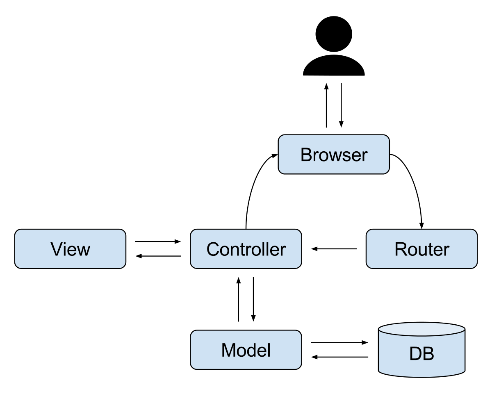

## chapter 6-2

### 액터들도 사람입니다.(항상 그렇지는 않지만)

* **게임 디자이너**, **게임 자체**도 여러분이 만들 프레임웤을 이용할 액터입니다.
* 유스케이스 다이어그램에 새로운 액터(게임 자체)를 추가해 봅시다.

* 게임이 프레임웍을 이용해서 하는일들(유스케이스)을 추가했다.
* 게임이 우리 시스템과 상호작용한다.

기존 유스케이스에서 연결되지 않은 특징인 
`프레임웍은 누구의 차례인지에 대한 정보를 유지하고 유닛들의 기본적인 움직임을 관장한다.` 
는 새로운 유스케이스인 게임이 이용해서 하는일인 `유닛들 이동하기`과 연결된다.

### 연필을 깍으며

* 방금 말한 특징에서 기본적인 움직임에 대한 내용은 `유닛들 이동하기`와 어울리지만 나머지 내용들은 어울리지 않는다.

1. 누가 "프레임웍은 누구의 차례인지에 대한 정보를 유지한다"에 대한 액터입니까?

* 내 대답 : ~~게임~~
* 책 답 : 게임, 누구의 차례인지를 관리하기 위해 프레임웍을 이용합니다.

2. 이 특징의 일부를 지원하려면 어떤 유스케이스를 추가하겠습니다?

* 내 대답 : ~~유저관련, 턴 관련내용~~
* 책 답 : 프레임웍이 차례 바꾸기와 관련된 기본적인 일을 수행하고 게임별로 구체적으로 어떻게 바꾸는지에 대한 구체적인 내용을 다루게 하는 `차례 바꾸기`라는 유스케이스가 필요합니다.
* 또한 하나의 특징을 2 개로 나눌 수 있습니다.
* 프레임웍은 누구의 차례인지이에 대한 정보를 유지한다. - `차례 바꾸기`
* 프레임웍은 기본적인 이동을 관장한다. - `유닛들 이동하기`

### 우리가 정확히 무엇을 했나요?

* **특징 또는 요구 사항 리스트로 시스템이 해야 할 큰 일을 알아냈다.**
* **유스케이스 다이어그램을 그려서 필요 없는 세부 사항에 얽매이지 않고 여러분이 만들어야 할 시스템을 나타냈다.**

_특징 리스트(시스템이 이러한 일들을 해야 한다.)_

### 도메인분석

#### 회의실 잡담

* _짐_ : 이제 코드에 대한 이야기 하자. 특징리스트, 유스케이스가 필요한걸 아는데 결국 실제로 만들어야 하는거잖아?
* _프랭크_ : 나도 잘 모르겠어. 지금 얘기하는게 코드와 관련된 것 같아.
* _짐_ : `프레임웤이 다양한 타입의 지형을 지원한다`가 어떻게 코드와 연결되는거지?
* _프랭크_ : 특징리스트는 코드의 한 라인으로 연결되지는 않지만 한 덩어리의 코드로 연결되잖아.
* _짐_ : 맞아. 하지만 클래스를 작성하고 그러한 클래스들을 묶을 패키지는 언제 얘기 하지?
* _프랭크_ : 할텐데. 우선 고객들이 그러한 용어을 잘 모르니 하게 될 경우 고객이 원하는 시스템을 제대로 만드는 것인지 확인할 수가 없어.
* _짐_ : 클래스 다이어그램으로 보여주면 안돼?
* _프랭크_ : 그래도 되지만 역시 고객들이 이해 못할 수 있어. 그래서 **도메인 분석**이 필요해. 고객과 고객의 시스템에 대해 고객이 이해하는 용어로 얘기할 수 있어. 고객과 이야기 할때 **클래스, 객체, 메소드를 유닛들, 지형, 타일**에 대해 이야기 하는거지.

**특징 리스트를 이용해 고객에게 전달한다.**

> **도메인 분석** : 기존 시스템과 개발 이력, 도메인 전문가 들로부터 얻은 지식, 기반 이론, 그리고 도메인에서 새로 등장하는 기술을 기반으로 도메인 관련 정보를 찾아 내고, 모으고, 구조화하고, 나타내는 프로세스

* 일반 고객들을 프로그래머가 아니므로 코드 수준의 세부정보(클래스, 패키지 다이어그램 등)을 주면 이해하지 못한다.
* 따라서, 특징리스트처럼 고객이 이해하는 언어로 작성된 정보를 제공한다.

### 이젠 나눠서 정복합시다.

* 이제 큰 문제(게리의 게임 프레임웍)을 쪼개어 기능의 작은 조각들로 나눌때이다.
* 현재 설계한 거대한 프레이웍을 조각으로 쪼개자.
* **시대적 배경** : 이건 다양한 지형들, 유닛들, 타일들 제공하면 해결된다.
* **유닛들** : 기본 유닛을 나타내는 방법이 필요하고, 게임 디자이너가 그것을 상속하여 게임에 맞는 유닛을 만들 수 있게 해야 한다.
* **타일들** : 프레임웍은 기본 타일을 가지고 있고, 각 타일은 지형 타입들, 유닛들을 지원할 수 있어야 하고, 아마 전쟁도 다룰 수 있어야 한다.
* **지형 타입들** : 각 타일은 최소한 하나의 지형 타입을 지원하고, 게임 디자이너들은 들판에서부터 호수, 행성까지 그들만의 지형 타입을 만들어서 사용할 수 있어야 합니다.

### 크게 나누기

* 시스템에서 해야 할일을 보여주기 위해 사용한 **특징리스트**와 **다이어그램**을 보고 어떤 모듈들을 사용하여 이러한 모든 기능을 해결할 지, 그리고 어떻게 특징들과 요구 사항들을 나눌 지를 알아내야 합니다.

~~모듈 나누는 방식~~

### 우리가 나눈 방식

* **Units** : 부대, 군대, 모든 유닛들에 대한 내용
* **Board** : 보드 자체와 타일, 지형 그리고 각 게임에서 사용되는 실제 보드를 만드는 것과 관련된 내용
* **Game** : 디자이너가 확장할 기본 클래스들을 저장하는데 사용, 게임의 시대적 배경, 기본 속성, 그 외에 각 게임의 기본 구조를 정하는 것과 관련된 내용
* **Controller** : 플레이어의 순서, 기본적인 이동, 게임의 실제 흐름과 과련된 내용(디자이너가 마드는 게임의 "교통정리"를 담당)
* **Utilities** : 모듈들간 공유하는 도구나 helper 클래스들을 보관하기위해 Utilities 모듈을 두는 것은 언제나 좋은 생각입니다.

_정답은 없습니다. 시스템을 설계하는 방법은 많습니다. **중요한건 디자인이 모든 특징과 유스케이스들을 해결하고 있는지, 그리고 말이 되는지입니다**._

* 일반 사용자 고객이 봤을때는 그래픽카드도 없고 재미 없어 보입니다.
* 하지만, 우리는 **게임 디자이너**를 위한 프레임웍을 만드는것이지, 실제 게임을 만드는 것이 아닙니다.
* 그래픽은 게임디자이너가 알아서 할 내용이다.

> 도메인 분석을 하면 여러분이 만들 필요가 없는 시스템의 부분을 만들지 않는데 도움이 됩니다.

### MVC

* 게임디자이너가 그래픽 모듈을 넣기만 하면 이것이 MVC 패턴과 유사하다.
* Model : Board, Units
* View : Graphics
* Controller : Controller

##### mvc1

##### mvc2

##### mvc3

##### mvc4

##### mvc5

##### mvc6

### 디자인패턴

* 우리는 이미 만들어진 라이브러리와 프레임웍을 이용했습니다. API 를 이용하거나 다른 사람 코드를 복사해서 사용했습니다.
* 즉 컴포넌트를 찾아 연결하는 방식의 개발 모델입니다.
* 이런 개발 모델은 프로그램을 이해하기 쉽고, 유지보수와 유연성이 높은 방식으로 구조화하는 데에는 도움이 되지 않습니다.
* 이럴때 **디자인패턴**을 사용합니다.

### OOA&D(와 약간의 상식)의 힘

1. 고객의 말에 귀를 기울이고 들었습니다.(비전 기술서)
1. 우리가 시스템을 이해하는지 확인했습니다.(도메인분석 사용해 특징리스트 작성)
1. 우리가 만드는 시스템에 대한 청사진(설계도)을 그렸습니다.(유스케이스 다이어그램)
1. 큰 문제를 기능의 작은 조각들로 나누었습니다.(모듈)
1. 작은 문제들의 해결에 디자인 패턴을 적용합니다.(MVC)
