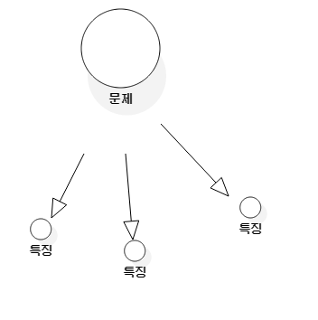

#chapter 9-2

## Unit 클래스 작성해 봅시다.

``` js
class Unit {
  constructor (id) {
    this.id = id;
  };
  getId() {
    return this.id;
  }
  getName() {
    return this.name;
  }
  setName(name) {
    this.name = name;
  }
  getType() {
    return this.type;
  }
  setType(type) {
    this.type = type;
  }
  addWeapon(weapon) {
    if (!this.weapons) {
      this.weapons = [];
    }
    this.weapons.push(weapon)
  }
  getWeapons() {
    return this.weapons;
  }
  setProperty(property, value) {
    if(!this.properties) {
      this.properties = new Map();
    }
    this.properties.set(property, value);
  }
  getProperty(property) {
    if(!this.properties) {
      return null;
    }
    return this.properties.get(property);
  }
}

// 1,2 차이점?

class Unit1 {
  constructor (id) {
    this.id = id;
  }
  setId(id) {
	this.id = id;
  }
  getId() {
    return this.id;
  }
}

class Unit2 {
  setId(id) {
	this.id = id;
  }
  getId() {
    return this.id;
  }
}
```

* `weapon`리스트가 필요할때까지 배열을 생성하지 않는다. 메모리 절약을 위해!(몇천개의 유닛일때 절약된다.) `property`도...

## 테스트 케이스 해부

1. 각 테스트 케이스는 아이디와 이름을 가지고 있어야 합니다.
    - 정확한 이름을 사용해야 한다. `test1, test2` 이런거 말고
2. 각 테스트 케이스는 그것이 테스트하는 특정한 것 하나를 테스트 해야 합니다.
    - 한번에 한가지 기능만을 테스트
3. 각 테스트 케이스는 여러분이 제공하는 입력 값을 가지고 있어야 합니다.
    - 만약 `hitPoints`의 값을 15로 설정하면 15는 테스트 케이스에 제공된 입력값이 된다.
4. 각 테스트 케이스는 예상되는 출력 값을 가지고 있어야 합니다.
    - 이것이 우리가 원하는 프로그램의 출력 값입니다. 보병을 설정하면 호출시 보병이 출력되야 한다.
5. 대부분의 테스트 케이스는 초기 상태를 가지고 있습니다.
    - DB연결 하거나, 객체를 생성하거나, 혹은 설정 값이 필요한 상태를 초기상태라 한다.

## 테스트 케이스 설계

ID  |테스트제목  |입력값   |예상 출력값   |초기 상태
--|---|---|---|--
1  |type 속성 설정하기/가져오기   |"type", "infantry"   |"type", "infantry"   |Unit 객체가 존재해야 함
2  |hitPoints 속성 설정하기/가져오기   |"hitPoints", 25   |"hitPoints", 25   |Unit 객체가 존재해야 함
3  |이미 존재하는 속성 값 변경하기   |"hitPoints", 15   |"hitPoints", 15   |hitPoints 값이 25로  설정된 유닛 객체가 존재해야 함
4  |존재하지 않는 속성 값 가져오기   |N/A   |"strength", no value   |Strength 값이 없는 Unit 객체가 존재해야함

* 테스트 대부분, 입력 값으로 제공한 값이 그대로 출력 값이 됩니다.
* 공통 속성을 가지고 동작하는 테스트 1개, 특유의 개인 속성을 가지고 동작하는 테스트 1개가 있어야 합니다.
* 4번 테스트의 핵심은 속성에 어떤 값도 제공하지 않고, 그 속성의 값을 가져오려고 하는 것입니다.
* 4번 초기 상태 : 이 테스트 케이스를 위해 소것잉 전에 값을 갖지 않도록 해야 한다는 것을 알았나요?(몰랐음...)

## 바보같은 질문이란 없습니다.

* Q : 어떻게 3개의 테스트 시나리오가 4개의 테스트 케이스로 바뀌었나요?<br />
* A : 첫 번째 테스트 시나리오에서 공통 속성(`getType`) 및 가져오기와 개인 특유 속성(`getProperty`,hitPoints) 및 가져오기 2개 테스트를 했다.

* Q : 이 모든 테스트를 통해, 우리의 소프트웨어가 의도된 대로 동작한다는 것을 알 수 있는거죠? <br />
* A : 네. 좋은 출발입니다. 이걸로 우리는 문제 없이 작동된다고 고객에게 입증을 할 수 있고, 개발 주기가 많이 흘러가기전에 버그를 발견하는데 도움을 줍니다.

## 테스트 퍼즐 해답

``` js
class Weapon {
  constructor (weapon) {
    this.weapon = weapon;
  }
}

class UnitTester {
  testType(unit, type, expectedOutputType) {
    console.log("\nTesting setting/getting the type property");
    unit.setType(type);
    const outputType = unit.getType(type);
    if (expectedOutputType === outputType) {
      console.log("Test Passed");
    } else {
      console.log(`Test Failed: ${outputType} didn't match ${expectedOutputType}`);
    }
  }

  testUnitSpecificProperty(unit, propertyName, inputValue, expectedOutputValue) {
    console.log("\nTesting setting/getting a unit-specific property.");
    unit.setProperty(propertyName, inputValue);
    const outputValue = unit.getProperty(propertyName);
    if (expectedOutputValue === outputValue) {
      console.log("Test Passed");
    } else {
      console.log(`Test Failed: ${outputValue} didn't match ${expectedOutputValue}`);
    }
  }

  testChangeProperty(unit, propertyName, inputValue, expectedOutputValue) {
    console.log("\nTesting changing an existing property's value.");
    unit.setProperty(propertyName, inputValue);
    const outputValue = unit.getProperty(propertyName);
    if (expectedOutputValue === outputValue) {
      console.log("Test Passed");
    } else {
      console.log(`Test Failed: ${outputValue} didn't match ${expectedOutputValue}`);
    }
  }

  testNonExistentProperty(unit, propertyName) {
    console.log("\nTesting getting a non-existent property's value.");
    const outputValue = unit.getProperty(propertyName);
    if (!outputValue) {
      console.log("Test passed");
    } else {
      console.log(`Test failed with value of ${outputValue}`);
    }
  }

  testGetId(unit, expectedOutputId) {
    console.log("\nTesting getting id");
    const outputId = unit.getId();
    if (expectedOutputId === outputId) {
      console.log("Test passed");
    } else {
      console.log(`Test Failed: ${outputId} didn't match ${expectedOutputId}`);
    }
  }

  testAddWeapon(unit, weapon, expectedOutputWeapon) {
    console.log("\nTesting adding weapon");
    unit.addWeapon(weapon);
    const outputWeapon = unit.getWeapons();
    if (expectedOutputWeapon == outputWeapon) { // === 아니고 ==
        console.log("Test Passed");
      } else {
        console.log(`Test Failed: ${outputWeapon} didn't match ${expectedOutputWeapon}`);
      }
    }
}

const tester = new UnitTester();
const unit = new Unit(1000);
const axe = new Weapon("axe");
tester.testType(unit, "infantry", "infantry");
tester.testUnitSpecificProperty(unit, "hitPoints", 25, 25);
tester.testChangeProperty(unit, "hitPoints", 15, 15);
tester.testNonExistentProperty(unit, "strength");
tester.testGetId(unit, 1000);
tester.testAddWeapon(unit, axe.weapon, axe.weapon); // 객체로 받는 부분...TT

```

* 각각의 메소드가 `Unit`클래스의 다른 부분을 테스트하고 있으므로 인자들이 다르다.
* 대부분의 테스트는 예상되는 출력값(`expectedOutputValue`)과 실제 출력 값(`outputValue`)의 비교로 끝납니다.

## 그리고 지금 보너스에 대한...

* `UnitTester`에서 테스트되지 않은 3개의 공통 속성을 다루기 위해, 우리는 테이블에 3개의 테스트를 추가했습니다. 이 테이블을 보고 여러분은 3개의 추가적인 테스트 메소드를 작성할 수 있어야 합니다. 이것을 알아냈나요?(뭐를....알아냈는가??)

ID  |테스트제목  |입력값   |예상 출력값   |초기 상태
--|---|---|---|--
1  |type 속성 설정하기/가져오기   |"type", "infantry"   |"type", "infantry"   |Unit 객체가 존재해야 함
2  |hitPoints 속성 설정하기/가져오기   |"hitPoints", 25   |"hitPoints", 25   |Unit 객체가 존재해야 함
3  |이미 존재하는 속성 값 변경하기   |"hitPoints", 15   |"hitPoints", 15   |hitPoints 값이 25로  설정된 유닛 객체가 존재해야 함
4  |존재하지 않는 속성 값 가져오기   |N/A   |"strength", no value   |Strength 값이 없는 Unit 객체가 존재해야함
5  |id 속성 가져오기   |N/A   |1000   |id값이 1000으로 설정된 Unit 객체가 존재해야 함
6  |name 속성 설정하기/가져오기   |"name", "Damon"   |"name", "Damon"   |Unit 객체가 존재해야 함
7  |weapons 추가하기/가져오기   |Axe object   |Axe object   |Unit 객체가 존재해야 함

* 5번 테스트 구현, 6,7번은 기존 테스트 코드랑 비슷하여 생략

## 여러분 자신을 고객에게 입증해 보이세요.

* 테스트 클래스들로 소프트웨어가 의도된대로 동작하는 것을 보여줍니다.
* 고객은 클래스 다이어 그램을 봤을때보다 동작하는 코드를 보고 좋아합니다.

### 게임 시스템의 프로그래밍 약속을 변경하여 봅시다.

* 소프트웨어를 작성할 때, 여러분은 소프트웨어와 사용자 사이에 약정을 만드는 것입니다.
* 약정은 어떤 행위가 취해졌을때(유닛에 존재하지 않는 속성을 요청한것 처럼) 소프트웨어가 어떻게 작동될것인지 자세히 설명합니다.
* 만약 고객이 어떤 행위가 다른 행동으로 나타나길 원한다면, 그땐 약정을 변경해야 합니다.
* 만약 존재하지 않는 속성을 조회했을 때, 게리의 프레임웍이 예외 상황을 전져야 한다면, 그것은 괜찮습니다.
* 이것은 단지 게임 설꼐자와 프레임웍 사이의 약정이 변경된 것을 의미합니다.
* **당신이 약정에 의해 프로그램을 작성할때, 당신과 당신의 프로그램 사용자는 소프트웨어가 어떤 방식으로 동작할것이라는 것에 동의하고 있는 것입니다.**

## 약정에 의한 프로그래밍

* 우리는 지금까지 약정(contract)에 의해 프로그램을 작성했습니다.
    - `Unit`클래스에서 존재하지 않은 속성을 요청하면 `null`을 반환했습니다.
    - 아까 작성한 코드는 속성이 존재하지 않을때, 무슨 일이 ㅂ라생할 것인지에 대한 약정을 정의하고 있습니다.
* 이것은 유닛의 약정입니다.
    - `Unit`클래스는 그것을 사용하는 사람이 유능한 프로그래머이며, 그들이 반환되는 `null`을 잘 다룰 수 있다고 가정합니다.
    - ex) 당신은 정말 유능합니다. 만약 당신이 없는 속성을 욫어한다면, 나는 null을 반환하려 합니다. 당신은 null을 잘 다룰 수 있죠? 그렇죠?
* 약정에 의한 프로그래밍이란 정말로 모두 믿음에 관한 것입니다.
    - 프로그래머를 믿는다.(존재하는 속성만 요청한다.)
* 그리고 우리는 필요하다면 언제든지 약정을 변경할 수 있습니다.
    - null대신 예외처리를 해달라.(우리는 존재하는 속성만 요청할테니 만약 그렇지 않으면 에러 던져라. 그러면 프로그램이 멈추는 대신 우리는 버그를 잡을 것입니다. 믿어주세요. 예외 상황은 문제가 되지 않습니다.)
    - 맞아요. 내가 예외 상황을 던질수 있는걸 알면 서로 나아갈 수 있다. 코드를 변경하고 나는 새로운 약정을(예외 처리) 사용하기 시작할 것입니다.

## 방어적 프로그래밍

### 만약 여러분이 사용자를 못 믿는다면...

* (코드가 정확하게 사용될 것이라고 믿지 않거나 어떤 행위가 잘못된 생각이어서 사용자에게 그들 자신의 방법으로 그것들을 다루는 것을 원치 않는다면?)
* 예) 기존 존재하지 않은 속성을 요청시 `null`을 반환했지만 `null`을 반환받고 제대로 처리를 못할 수도 있다. 이런 경우를 대비해 예외를 던진다.
* **방어적 프로그래밍**은 최악의 상태를 가정하여, 잘못된 사용과 잘못된 데이터로부터 자신을 보호하려고 합니다.

``` js
getProperty(property) {
  if(!this.properties) {
    // return null;
    throw "Waht are you doing? No properties!";
  }
  return this.properties.get(property);
}
```

### 그들이(사용자) 여러분을 못믿는다면...

* 프로그래머가 우리가 만든 코드를 믿지 못하는 경우는 많은 오류 체크를 합니다.
* 예를 들어 심지어 `getProperty()`가 null이 아닌 값을 반환할 것이라고 믿지 않는다.(즉, null만 나온다...)

``` js
const unit = new Unit(1000);
//...
const name = unit.getName();
if(name != null) && (name.length() > 0) {
  //...
}
```

## 바보같은 질문이란 없습니다.

* Q : 예외 상황을 던지는 것으로 약정을 바꿀 수 있다고 했으나 여기서는 예외 상황을 던지는 것을 방어적 프로그래밍이라고 하니 혼란스럽다.<br />
* A :
    - 어떤 종류의 예외 상황을 던지는가는 중요하지 않습니다. 중요한 것은 당신의 고객과 의로인이 어떻게 이 결정에 참여하고 있느냐 하는 것입니다.
    - 약정에 의한 프로그래밍에서는 당신이 문제를 어떻게 다룰 것인지를 합의하기 위해 고객과 함게 일합니다.
    - 방어적 프로그래밍에서는 고객이 어떻게 되길 원한다 해도, 당신은 당신의 코드가 고장 나지 않는 방향으로 결정합니다.

## 약정에 의한 프로그래밍 vs 방어적 프로그래밍

* 약정 : 프로그래머, 사용자 서로가 믿고 적합하지 않은 요청을 하지 않는다.
* 방어 : 믿을 수가 없으니 효율성이 조금 떨어지더라도 안전하게 코드를 작성한다.

## 나는 누구인가?

* **특징 주도 개발, 유스케이스 주도 개발, 약정에 의한 프로그래밍 그리고 방어적 프로그래밍** 대화 맞추기

* 나는 잘 정돈되어 있습니다. 나는 단계마다 차례로 무언가 가져와서, 시작부터 끝까지 그것을 작성하는 것을 더 좋아합니다. : **유스케이스 주도 개발**
* 글쎄, 그녀가 확실히 전화한다고 말했지만, 당신이 어느 누구도 더 이상 믿지 않는다면 어떡하지요? : **방어적 프로그래밍**
* 오, 당연히, 요구 사항은 저암ㄹ로 나에게 동기를 부여합니다. : **특징 주도 개발, 유스케이스 주도 개발**(약정도 가능하다. 왜냐하면 약정이란 요구사항의 한 형태이기 떄문이다.)
* 나는 행동이 매우 바릅니다. 실제로, 나는 다른 것에 신경 쓰기 전에, 나의 행동 모두에 관심을 집중해 왔습니다. : **특징 주도 개발**
* 정말로, 그것은 모두 나의 고객에 대한 것입니다. 나는 단지 그들을 만족시켜 주기를 원합니다. : **4개 모두**
* 여보세요. 당신은 다 큰 어른입니다. 당신은 스스로 그것을 다룰 수 있습니다.. 그것은 더 이상 내 문제는 아닙니다. 그렇지 않나요? : **약정에 의한 프로그래밍**
* 당신이 좋으면, 나도 그렇습니다. 당신이 나에게 기대하는 것이 무엇인지 알면, 당신에게 뭉서을 해야 할지 말해주는 나는 누구일까요? : **약정에 의한 프로그래밍**

## Unit에 대한 프로그래밍 약정을 수정하기

* 게리의 고객들은 자신들이 `Unit`을 정확하게 사용할 것이라고 가정하길 원합니다.(약정) 따라서 존재하지 않는 속성이 조회되면, 게임에서 무언가 완전히 잘못된 것이고, 예외 상황이 던져지는 것이 필요하다는 것을 의미합니다.

1. 존재하지 않는 속성이 호출되면 예외 상황을 던지도록 수정하세요.

*(Unit.java)*

``` js
getProperty(property) {
  if(!this.properties) {
    // return null;
    throw "No properties for this Unit."
  }
  // return this.properties.get(property);
  const value = this.properties.get(property);
  if (!value) {
    throw "Request for non-existent property.";
  } else {
    return value;
  }
}
```

*(UnitTester.java)**

``` js
testNonExistentProperty(unit, propertyName) {
  console.log("\nTesting getting a non-existent property's value.");
  try {
    const outputValue = unit.getProperty(propertyName);
  } catch (e) {
    console.log("Test passed"); // 존재 하지 않는 속성을 getProperty해서 에러가 발생되어 catch문으로 오게 된다.
    return;
  }
  console.log("Test failed");
}
```

* 여러분이 **약정에 의한 프로그래밍**을 할 떄, 문제 상황을 어떻게 다룰 지 합의하기 위해 고객의 코드와 같이 작업하는 것입니다.
* 여러분이 **방어적 프로그래밍**을 한다면, 고객이 **어떠한 일이 발생되기**를 원하건 간에, 고객이 안전한 응답을 얻도록 확인할 것입니다.

## 바보같은 질문이란 없습니다.

* Q : 왜 당신은 `IllegalAccessException과 같은 점검이 필요한 예외 상황이 아니라. `RunTimeException`을 던지고 있습니다?<br />
* A : 예외 상황을 사용한다면, `getProperty()`를 호출하는 코드는 이 예외 상황을 `try/catch`구문으로 점검해야 합니다. 하지만 이것은 고객이 원하는 바가 아닙니다. 우리는 그들이 코드에서 어떠한 예외 상황도 잡아서 처리할 필요가 없도록 한다는 약정에 동의하였습니다.

**에러**

* `IllegalAccessException`은 체크예외, `RunTimeException`은 언체크예외
* 체크예외는 예외처리를 꼭 작성해줘야 하고 언체크예외는 작성하지 않아도 된다.
* [http://hyeonstorage.tistory.com/199](http://hyeonstorage.tistory.com/199)
<br />
* Q : `weapons`, `id`, `name`과 같은 속성에 대한 접근 메소드는 어떻게 되나요?<br />
* A : `id`는 `int`이고 생성될 때 필요, `name`은 `String`이거나 `null`, `weapons`은 `List`이므로 아무것도 없으면 `null list`를 반환할 것입니다. 비록 고객한테 특별히 요청 받지 않더라도, `weapons`의 `list`가 비어있을 때 예외 상황을 던지도록 메소드를 변경할 수 있습니다.
<br />
* Q : 당신은 약정에 의한 프로그래밍은 코드가 짧게 된다고 말했습니다. 그러나 `Unit.java`에는 많은 코드가 추가된 것처럼 보입니다.<br />
* A : 그것은 직접 `null`을 반환하는 대신, 우리가 새로운 `RunTimeException`을 던졌기 때문입니다. 이건 규정에 비해 특별한 경우 입니다. 대부분의 경우 이용하는 쪽에서는 많은 추가적 코드가 발생하지 않을 것입니다. 왜냐하면 `null` 값이 아닌지, 데이터가 특정 범위에 있는지 확인하는 것 없이 단지 객체나 값을 반환하기 때문입니다.
<br />
* Q : 저는 여전히 왜 우리가 약정에 의한 프로그래밍으로 전환했는지 이해가 안 돼요. 왜 이것이 더 나은가요?<br />
* A : 이것은 좋고 나쁨의 문제가 아닙니다. 이것은 고객이 무엇을 원하는가의 문제입니다.

## 유닛 이동하기

~~1. 각각의 유닛은 속성들을 가져야 하고, 게임 설계자는 자신의 게임에서 새로운 속성들을 유닛의 유형으로 추가할 수 있습니다.~~
**2. 유닛은 보드 위의 한 타일에서 다른 타일로 이도할 수 있어야합니다.**
3. 유닛은 그룹지어 부대가 될 수 있습니다.

### 애플리케이션을 기능의 작은 덩어리도 나누어보세요.

* 각각의 문제를 이야기하고, 문제의 일부를 계속해서 해결하고 있습니다.
* **하나의 특징을 선택하여 완성될 때까지 그 특징을 가지고 작업해나가는 일**



### 여전히 더 나눌 수 있습니다.

* 하나의 특징이나 유스크에시를 선택하면, 대체로 그 특징을 더 작은 행위로 나눌 수 있습니다.
* 애플리케이션을 나누어 반복 작업을 시작할 때처럼, 각 단계에서 더 나아간 분석과 설계가 이루어져야 합니다. 항상 이전 결정들을 이치에 맞는 확인하고, 그렇지 않다면 그 결정들을 변경하거나 재작업 하세요.


### 결정은 또한 아래로 반복 작업할 수 있습니다.

* 게리의 시스템에서는 게임 설계자가 그들 스스로 이동을 다루도록 결정하였습니다. 그러므로 유닛의 이동을 어떻게 다룰지이에 대해 이야기 하고 있는데, 여기서 이전의 결정을 적용할 수 있습니다. 그것은 여전히 타당하기 때문입니다.(게임 설계자를 위해 이동은 그들의 몫이라는 것을 문서에 기록하세요.)

## 특징 퍼즐

* 지금까지 특징 주도 개발, 반복 작업, 분석과 설계를 매우 견고하게 했습니다. 마지막의 행위를 다루는 것을 여러분에게 남기고, 게리의 게임 시스템 프레임웍의 유닛의 특징을 마칠 것입니다.
* 문제 : 게리의 프레임웍은 유닛의 그룹을 지원할 필요가 있습니다.
* 여러분이 해야 할 일
    1. 유닛을 함께 그룹지을 수 있도록 하는 새로운 클래스를 작성하세요. 그리고 유닛을 그룹에 추가하고 제거해보세요.
    2. 아래의 테이블을 테스트 케이스 시나리오로 채워서 게리에게 유닛을 그룹 짓는 것이 동작한다는 것을 증명해 보세요.
    3. 테이블의 테스트 시나리오를 수행하기 위해 UnitTester에 메소드들을 추가해 보고 모든 테스트가 통과되는 것을 확인해보세요.

ID  |테스트제목   |입력값   |예상출력값   |초기상태
--|---|---|---|---
10  |유닛 리스트로부터 새로운 UnitGroup 생성하기   |유닛의 리스트   |동일한 유닛의 리스트   |UnitGroup의 인스턴스가 존재 하지 않음
11  |유닛을 그룹에 추가하기   |100이란 아이디를 가진 유닛   |100이란 아이디를 가진 유닛   |입력된 값이 없는 UnitGroup
12  |아이디로 유닛 가져오기   |100   |100이란 아이디를 가진 유닛   |입력된 값이 없는 UnitGroup
13  |그룹의 모든 유닛 가져오기   |N/A   |초기 리스트 같은 유닛의 리스트   |알려진 유닛 리스트를 가진 UnitGroup
14  |유닛의 아이디로 유닛 삭제하기   |100   |유닛의 리스트(아이디가 100인 유닛이 없는)   |입력된 값이 없는 UnitGroup
15  |유닛 인스턴스로 유닛제거하기   |100이란 아이디를 가진 유닛   |유닛의 리스트(아이디가 100인 유닛이 없는)   |입력된 값이 없는 UnitGroup

``` js
group.addUnit(unit)
group.removeUnit(unit or id)
group.getUnit(id)
group.getUnits()
```
