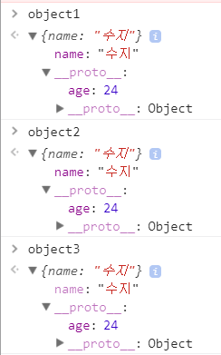
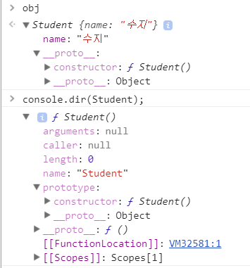
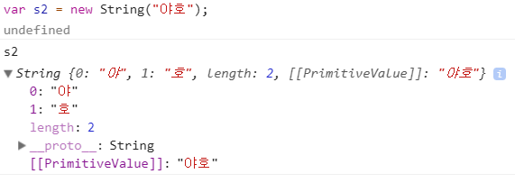

# 클래스 답사

> ES6는 생성자를 만들고 상속을 다루는, 훨씬 간결하고 단정한 구문을 제공한다. 자바스크립트는 객체 지향 언어라고 하면서도 클래스 개념조차 전무하다. ES6클래스로 객체 지향 자바스크립트를 알아보자.

## 객체 지향 자바스크립트

### 자바스크립트 데이터 타입

* 숫자
* 문자
* 불리언
* null
* undefined
* 심볼
* 객체

7가지 데이터 타입이 있다.

객체는 객체 자신이 아닌, 객체를 가리키는 참조값(메모리 주소)을 저장한다.

객체 아닌 데잍 타입은 원시 데이터 타입(primitive data type)이라고 한다.

### 객체 생성

* 객체 리터럴 : 정적인 객체를 생성할때
* 생성자 : 동적으로 객체를 생성할떄

두 가지 방법으로 객체를 생성한다.


``` js
// 객체 리터럴
var student = {
  name: "수지",
  printName: function() {
  	console.log(this.name);
  }
}

student.printName(); // "수지"
```

`student` 객체 하나를 만들때는 괜찮지만 여러개를 만들때는 번거롭고 비효율적이므로 이때 **생성자**를 사용한다.

``` js
// 생성자 함수
function Student(name)
{
  this.name = name;
}

// this 키워드가 아닌 생성자의 prototype 프로퍼티를 이용하여 생성자 인스턴스에 메소드를 추가
Student.prototype.printName = function() {
  console.log(this.name);
}

// 생성자를 2번 호출
var student1 = new Student("수지");
var student2 = new Student("민호");

student1.printName(); // "수지"
student2.printName(); // "민호"
```

객체는 생성자에 속한다. 모든 객체는 객체 생성자를 가리키는 `constructor`프로퍼티를 상속한다. 객체 리터럴로 객체를 생성할 경우 `constructor`는 전역 `Object`생성자를 가리킨다.

``` js
var student = {};

console.log(student.constructor == Object); // "true"
console.log(student.constructor === student.__proto__.constructor); // "true"
console.log(student.__proto__.constructor == Object); // "true"
```

### 상속

* 자바스크립트 객체는 내부 `[[prototype]]` 프로퍼티로 다른 객체의 프로토타입을 참조한다.
* 프로토타입 객체도 자신의 프로토타입을 갖고 있고, 프로포타입이 `null`이 될 때까지 체인은 이어진다.
* `null`은 프로토타입 체인의 마지막 지점으로 더 이상 참조할 프로토타입이 없음을 의미한다.
* 자바스크립트 객체는 단 하나의 프로토타입을 가지므로 단일 상속만 지원한다.

객체 리터럴로 객체를 생성할 경우, 특수 프로퍼티 `__proto__`를 이용하거나 `Object.setPrototypeOf()` 메소드로 객체 프로토타입 자체를 할당한다.

`__proto__`,`Object.create()` 사용하기에는 현재 적합하지 않아 `Object.create()` 메소드로 주어진 프로토타입을 지닌 새 객체를 생성하는게 보통이다.

``` js
var object1 = {
  name: "수지",
  __proto__: {age:24}
}

var object2 = {name: "수지"};
Object.setPrototypeOf(object2, {age:24});

var object3 = Object.create({age: 24}, {name: {value: "수지"}});

console.log(object1.name + " " + object1.age);
console.log(object2.name + " " + object2.age);
console.log(object3.name + " " + object3.age);
```



이 예제에서 상속받은 `{age:24}` 객체를 기반 객체(base object), 상위 객체(superobject), 부모 객체(parent object)라고 한다.

또 다른 객체를 상속한 `{name:"수지"}` 같은 객체를 파생 객체(derived object), 하위 객체(subobject), 자식 객체(child object)라고 부른다.

* 객체 리터럴로 객체를 생성할 경우, 프로토타입을 할당하지 않으면 해당 객체의 프로토타입은 `Object.prototype` 프로퍼티를 가리킨다. 프로토타입 체인 끝이라서 `Object.prototype`의 프로토타입은 `null`이다.

``` js
var obj = {
  name: "수지"
}

console.log(obj.__proto__ == Object.prototype); // "true"
```

* 생성자로 객체를 생성할 경우, 새 객체의 프로토타입은 함수 객체의 `prototype`프로퍼티를 참조한다. 이 프로퍼티는 기본적으로 함수 자신을 가리키는 `constructor`라는 프로퍼티 하나로만 구성된 객체다.

``` js
function Student() {
  this.name = "수지";
}

var obj = new Student();

console.log(obj.__proto__.constructor == Student); // "true" 이 프로퍼티는 기본적으로 함수 자신을 가리키는 `constructor`라는 프로퍼티 하나로만 구성된 객체다.
console.log(obj.__proto__ == Student.prototype); // "true"  객체의 프로토타입은 함수 객체의 `prototype`프로퍼티를 참조한다.
```



* 생성자 인스턴스에 새 메소드를 추가하려면 생성자의 `prototype` 프로퍼티에 메소를 추가해야 된다.
* 생성자 바디에 `this`를 이용하면 모든 생성자 인스턴스에 추가되므로 메모리 측면에서 비효율적이다.

``` js
function Student(name) {
  this.name = name;
}

Student.prototype.printName = function() {
  console.log(this.name);
}

var s1 = new Student("수지");
var s2 = new Student("민호");

function School(name) {
  this.name = name;
  this.printName = function() {
    console.log(this.name);
  }
}

var s3 = new School("이학교");
var s4 = new School("저학교");

console.log(s1.printName == s2.printName); // true 생성자 prototype을 이용해 추가했으므로 생성자 인스턴스들은 같은걸 공유한다.
console.log(s3.printName == s4.printName); // false 생성자 바디를 이용해 추가했으므로 생성자 인스턴스들을 각각 가지고 있으므로 다르다.
```

* 같은 기능을 가진 함수라면 효율적인 생성자의 `prototype`프로퍼티에 메소드를 추가하는게 좋다.


#### 상속구현

* 자식 생성자는 부모 생성자를 호출하여 자신의 초기화 로직을 실행하고
* 부모 생성자의 `prototype`프로퍼티 메소드를 자식 생성자의 `prototype` 프로퍼티에 넣어야 자식 생성자 객체에서 끌어쓸 수 있다.
* 정해진 구현 방법 따윈 없으므로 일반적인 방법을 알아보자.

* 생성자로 객체 생성시 상속을 구현한 코드

``` js
function School(schoolName) {
  this.schoolName = schoolName;
}

School.prototype.printSchoolName = function() {
  console.log(this.schoolName);
}

function Student(studentName, schoolName) {
  this.studentName = studentName;

  School.call(this, schoolName); // this.schoolName = schoolName;
}

Student.prototype = new School(); // School 인스턴스를 Student.prototype에 할당
// School.prototype 사용가능
Student.prototype.printStudentName = function() {
  console.log(this.studentName);
}

var s = new Student("수지", "이학교");
s.printStudentName(); // 수지
s.printSchoolName(); // 이학교
```

~~Student.constructor 수정해야할듯?~~

* 이런 방법은 여러 다른 문제를 야기할 우려가 있어서 생성자에게 상속을 구현하는 확실한 방법이라고 하기는 어렵다. 가령, 부모 생성자가 단순한 프로퍼티 초기화가 아닌 `DOM` 조작같은 작업을 한다면 부모 생성자의 새 인스턴스를 자식 새성자의 `prototype` 프로퍼티에 할당하는 과정에서 문제가 터질 가능성이 있다.

### 원시 데이터 타입 생성자

* 원시 데이터 타입은 각자 생성자가 있고, 이들 생성자는 원시 타입을 감싸는 일을 한다.(`null, undefined`는 생성자가 없다.)
  * 예를 들어, `String` 생성자는 내부`[[PrimitiveValue]]` 프로퍼티에 실제 원시값을 담은 문자열 객체를 생성한다.
* 런타임 시점에서 필요할 때 언제라도 원시값을 해당 타입의 생성자로 감싸고 그렇게 만들어진 객체가 실행에 걸림돌이 되지 않도록 마치 원시값처럼 취급한다.



``` js
var s1 = "문자열";
var s2 = new String("문자열");

console.log(typeof s1); // string
console.log(typeof s2); // object

console.log(s1 == s2); // true
console.log(s1.length); // 6
```

s1은 원시타입, s2는 객체지만 비교(`==`)하면 `true` 그리고 s1에 `length` 프로퍼티가 존재한다.

이유는 런타임 시점에 다음과 같이 변환하여 실행하는 것이다.

``` js
var s1  = "문자열";
var s2  = new String("문자열");

console.log(typeof s1);
console.log(typeof s2);

// 변환 부분
console.log(s1 == s2.valueOf());
console.log((new String(s1)).length);
```

**ES6부터는 원시 타입에 해당 함수를 생성자로 호출하는 일이 금지된다. 즉, 원시 타입을 해당 객체로써 명시적으로 감사는 건 불가능**

### 클래스 다루기
